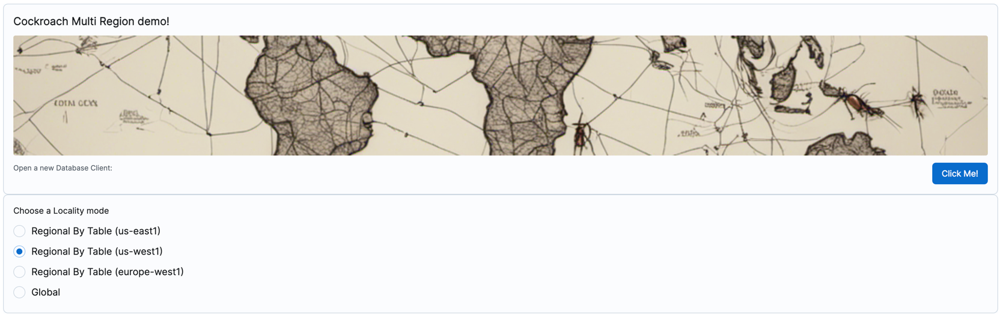
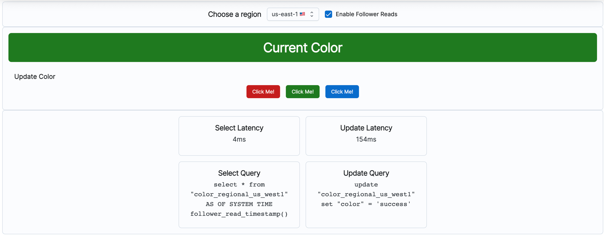

# Cockroach Multiregion Demo

An electron app to showcase various locality modes of CockroachDB.

## Features
* Two locality modes (GLOBAL and REGIONAL BY TABLE) with 3 possible regions table regions (us-east1, us-west1, europe-west1)
* Simulate a client connecting in different regions
* Continuously poll the database for a color value
* Show off SELECT (from the polling) and UPDATE (changing colors) latency
* Support follower reads

## Setup
1. Install [CockroachDB](https://www.cockroachlabs.com/docs/stable/install-cockroachdb.html)
2. Run the multi region demo
    ```bash
   cockroach demo --global --nodes 9 --no-example-database --insecure
   ```
3. Edit `src/connections.json` to match your database connection info. To get the database info, you can visit [CockroachDB Network Page](http://127.0.0.1:8080/#/reports/network/region) to figure out which nodes correspond to a region and run `\demo ls` on the cockroach console to get the connection strings.
4. Install project dependencies (only need to run once)
    ```bash
    yarn
    ```
5. Run the electron app
    ```bash
    yarn start
    ```

## Screenshots
### Main Window

### Client Window


## Notes
### CockroachDB demo mode
Cockroach has a [demo mode](https://www.cockroachlabs.com/docs/stable/cockroach-demo) that can simulate the latency of a multi region cluster.

### Database setup
There are 4 separate tables with different locality modes. It is much faster to switch which table is being queried vs altering the locality of a table.

## Technologies Used
* [Electron](https://electronjs.org/)
* [React](https://reactjs.org/)
* [Electron Forge](https://electronforge.io/)
* [Vite](https://vitejs.dev/)
* [CockroachDB](https://www.cockroachlabs.com/)
* [Knex.js](https://knexjs.org/)
* [JoyUI](https://mui.com/joy-ui/getting-started/)